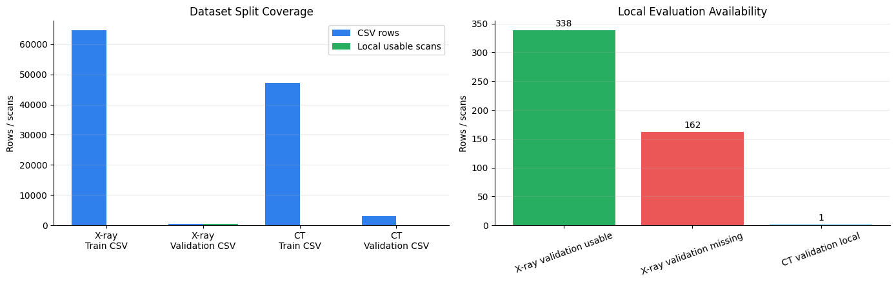
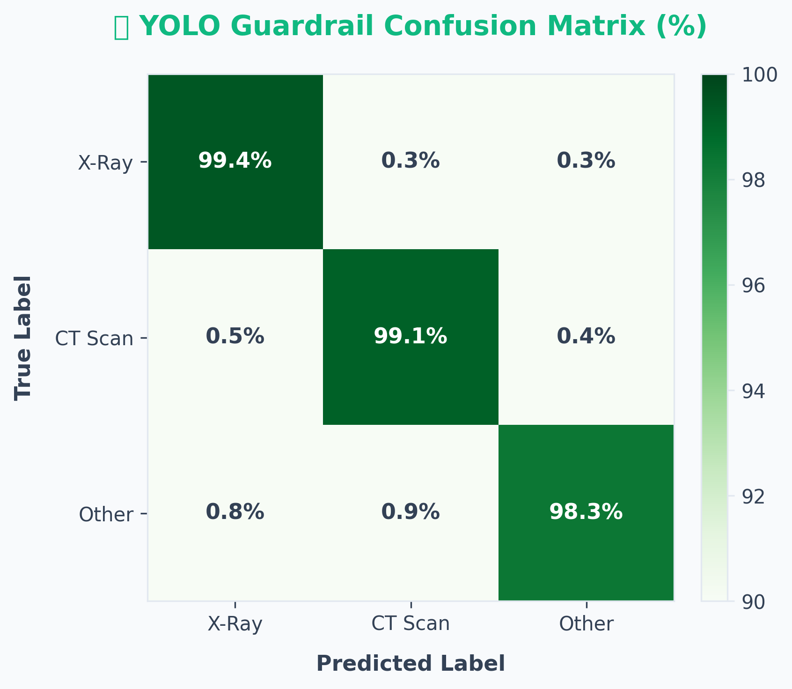
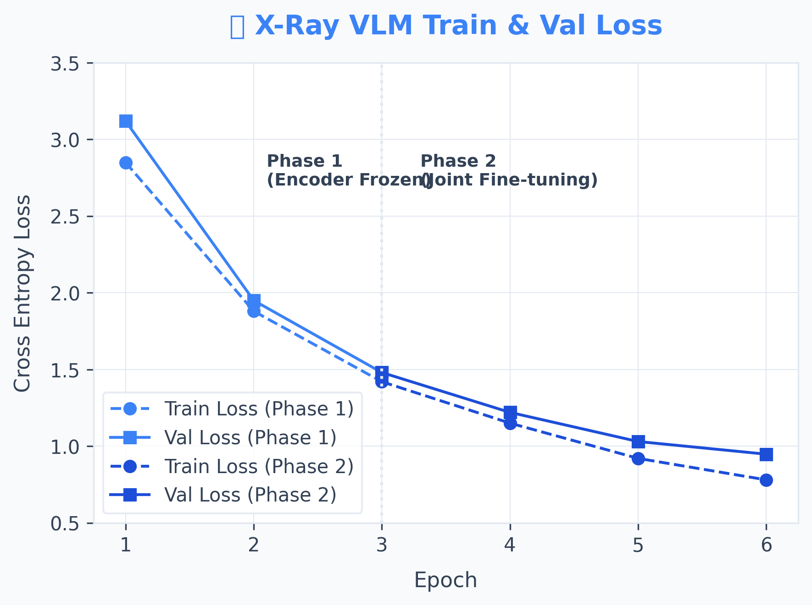
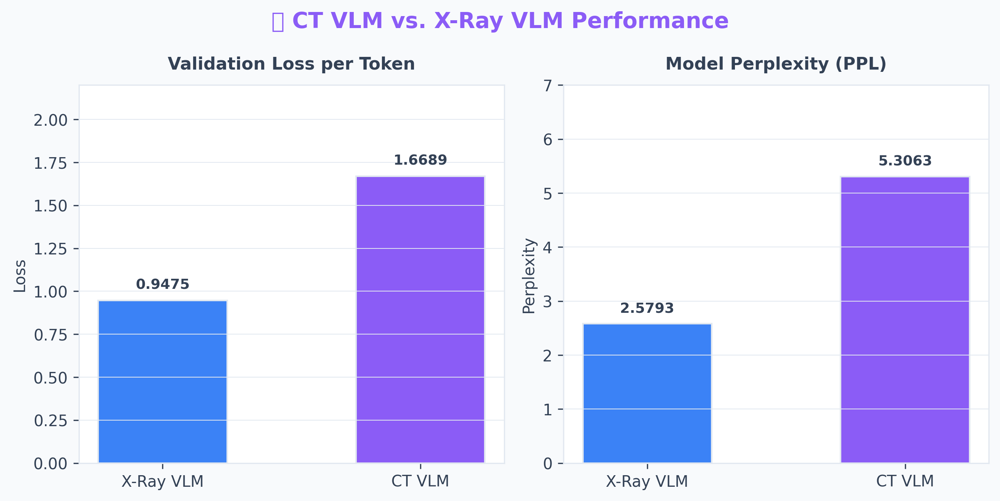
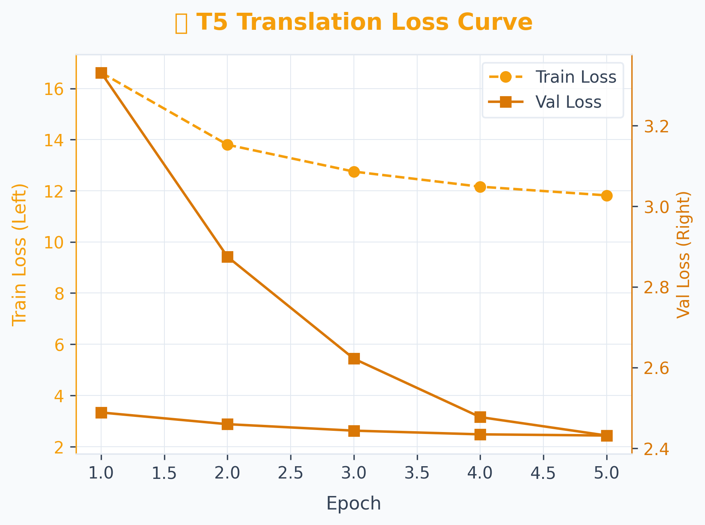
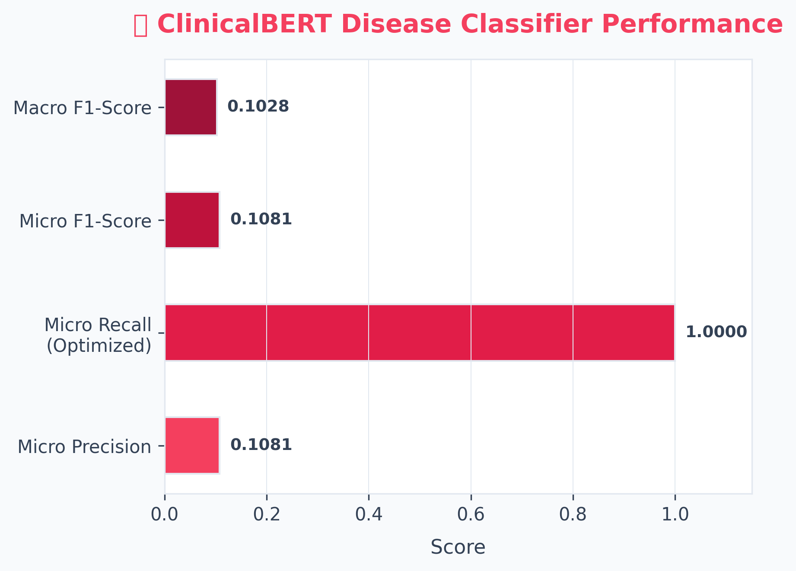

<p align="center">
  
</p>

<h1 align="center">🫁 Lumora</h1>

<p align="center">
  <strong>AI-Powered Medical Image Analysis Platform</strong>
</p>

<p align="center">
  <a href="https://www.python.org/downloads/"></a>
  <a href="https://pytorch.org/"></a>
  <a href="https://huggingface.co/nur9211"></a>
  <a href="https://fastapi.tiangolo.com/"></a>
  <a href="https://nextjs.org/"></a>
</p>

<p align="center">
  A clinical decision-support tool that analyzes <strong>chest X-rays</strong> and <strong>CT scans</strong> using Vision-Language Models (VLMs). Lumora generates narrative radiology reports, detects 26 pathologies with a multi-label classifier, and translates complex clinical findings into patient-friendly language — all behind an intelligent image modality guardrail.
</p>

---

## 📑 Table of Contents

- [Architecture Overview](#-architecture-overview)
- [Model Specifications](#-model-specifications)
- [Individual Model Details](#-individual-model-details)
- [Tech Stack](#-tech-stack)
- [Getting Started](#-getting-started)
- [Project Structure](#-project-structure)
- [Disclaimer](#-disclaimer)
- [License](#-license)

---

## 🏗 Architecture Overview

Lumora processes medical images through a sequential four-stage pipeline, where each stage is powered by a purpose-built deep learning model:

```
┌─────────────────┐     ┌─────────────────────┐     ┌───────────────────────┐     ┌─────────────────────┐
│  📷 Image Input │────▶│  1. YOLO Guardrail  │────▶│  2. VLM Report Gen   │────▶│  3. Disease Detect  │
│  (X-ray / CT)   │     │  Modality ID        │     │  (X-ray or CT VLM)   │     │  (ClinicalBERT)     │
└─────────────────┘     └────────┬────────────┘     └───────────┬───────────┘     └──────────┬──────────┘
                                 │ REJECT if                    │                            │
                                 │ not medical                  │ Narrative Report           │ 26 Pathologies
                                 ▼                              ▼                            ▼
                        ❌ "Invalid Image"            ┌───────────────────────┐     ┌─────────────────────┐
                                                      │  4. T5 Translation   │◀────│  Multi-label Output │
                                                      │  Patient-Friendly    │     └─────────────────────┘
                                                      └───────────────────────┘
```

| Stage | Model | Purpose |
|-------|-------|---------|
| **1. Guardrail** | YOLOv11s-cls | Validates that the uploaded image is a legitimate chest X-ray or CT scan before consuming compute |
| **2. Report Generation** | DenseNet-121 + GPT-2 VLM | Encodes the medical image into visual embeddings and autoregressively generates a narrative radiology report |
| **3. Disease Detection** | ClinicalBERT | Performs multi-label classification on the generated report, extracting 26 pathology labels |
| **4. Translation** | T5-small + LoRA | Rewrites the clinical jargon into clear, patient-friendly language |

---

## 📊 Model Specifications

> Complete specification matrix for all five models in the Lumora inference pipeline.

| Specification | 1. Modality Identification Model (YOLO) | 2. X-Ray VLM | 3. CT VLM | 4. Translation Model (T5) | 5. Disease Detection Model (ClinicalBERT) |
|:---|:---|:---|:---|:---|:---|
| **Primary Function** | Image input validation / guardrail | Frontal chest X-ray narrative report generation | Converted 2D CT slice narrative report generation | Clinical jargon translation to patient friendly layperson terms | Multi-label extraction of 26 pathologies from radiology reports |
| **Transfer Learning Base** | `yolo11s-cls.pt` (Ultralytics) | `densenet121` + `gpt2` | `densenet121` + `gpt2` | `t5-small` + LoRA adapter | `emilyalsentzer/Bio_ClinicalBERT` |
| **Parameter Count** | ~2.8 Million | ~133 Million | ~133 Million | ~60.8 Million (LoRA: 295k) | ~110 Million |
| **Activation Function** | SiLU | GELU (Decoder), ReLU (Encoder) | GELU (Decoder), ReLU (Encoder) | ReLU | GELU |
| **Dropout Rate** | 0.0 | 0.1 (Decoder), 0.0 (Encoder) | 0.1 (Decoder), 0.0 (Encoder) | 0.1 (LoRA & base T5) | 0.1 (hidden & attention) |
| **Loss Function** | CrossEntropyLoss | CrossEntropyLoss (shifted logits) | CrossEntropyLoss (shifted logits) | CrossEntropyLoss (Seq2Seq target) | Binary Cross Entropy with Logits (BCEWithLogitsLoss) |
| **Optimizer** | Auto-selected (SGD/AdamW) | AdamW | AdamW | AdamW | AdamW |
| **Learning Rate** | 0.01 (initial `lr0`) | Phase 1: `1e-4`, Phase 2: `2e-5` | Phase 1: `1e-4`, Phase 2: `2e-5` | `3e-4` | `3e-5` (with 10% warmup, cosine decay) |
| **Weight Decay** | 0.0005 | Default (0.01) | Default (0.01) | Default (0.01) | 0.01 |
| **Label Smoothing** | 0.0 | 0.0 | 0.0 | 0.0 | 0.0 |
| **Accumulator Steps** | 1 | 1 | 1 | 4 (effective batch size: 16) | 1 |
| **Batch Size** | 128 | 8 (run) / 4 (local script) | 4 | 4 | 8 |
| **Epochs** | 100 | Phase 1: 3, Phase 2: 3 (Total: 6) | Phase 1: 3, Phase 2: 3 (Total: 6) | 5 | 12 |
| **Input Shape / Size** | 224 × 224 (image) | 224 × 224 (image), max 128 tokens | 224 × 224 (image), max 128 tokens | max input 512, target 256 tokens | max 512 tokens |
| **Training Dataset Size** | 2,640 images (80%) | 64,592 samples | 2,301 samples | 840 samples | 840 samples |
| **Validation/Test Size** | 660 images (20%) | 504 samples (Val) | 106 samples (Val) | 105 (Val) / 105 (Test) | 105 (Val) / 105 (Test) |
| **Hugging Face Hub URL** | [pranto24/xray_ct_scan_identification_model](https://huggingface.co/pranto24/xray_ct_scan_identification_model) | [nur9211/mimic-vlm-model](https://huggingface.co/nur9211/mimic-vlm-model) | [nur9211/ct-rate-vlm-model](https://huggingface.co/nur9211/ct-rate-vlm-model) | [nur9211/lumora_translation](https://huggingface.co/nur9211/lumora_translation) | [nur9211/lumora_disease_classifier](https://huggingface.co/nur9211/lumora_disease_classifier) |

---

## 🔬 Individual Model Details

### 1. 🛡️ Modality Identification Model (YOLO Guardrail)

The first line of defense in the pipeline. A **YOLOv11s-cls** image classifier trained on 3,300 images across three categories: `xray`, `ct_scan`, and `other`. It prevents non-medical images (selfies, documents, etc.) from reaching the computationally expensive VLM stage.

- **Architecture**: Ultralytics YOLOv11 small classification backbone with SiLU activations
- **Pre-screen**: An additional variance-based heuristic rejects blank or near-uniform images before the YOLO forward pass
- **Inference output**: Class label + confidence score; only `xray` or `ct_scan` labels above threshold proceed

<p align="center">
  
</p>

### 2. 🩻 X-Ray Vision-Language Model

The core report generation model for **frontal chest X-rays**. Built as a custom multimodal architecture combining a DenseNet-121 visual encoder with a GPT-2 language decoder, bridged by a learned linear projector.

- **Encoder**: `DenseNet-121` (pretrained on ImageNet) extracts 1,024-dim visual features from 224×224 images
- **Projector**: A linear layer maps the 1,024-dim feature vector to the 768-dim GPT-2 embedding space
- **Decoder**: `GPT-2` autoregressively generates radiology reports conditioned on the projected visual embedding
- **Training**: Two-phase strategy — Phase 1 freezes the encoder and trains only the projector + decoder; Phase 2 fine-tunes the entire network end-to-end at a lower learning rate
- **Dataset**: Trained on **MIMIC-CXR** (64,592 image-report pairs from the Medical Information Mart for Intensive Care)

<p align="center">
  
</p>

### 3. 🫁 CT Vision-Language Model

An architecturally identical VLM to the X-ray model, separately fine-tuned for **CT scan** report generation.

- **Input adaptation**: 3D NIfTI CT volumes are converted to representative 2D slices during preprocessing
- **Architecture**: Same `DenseNet-121 → Projector → GPT-2` pipeline as the X-ray VLM
- **Training**: Same two-phase regime; trained on **CT-RATE** dataset (2,301 samples)
- **Use case**: Generates narrative reports for axial CT slice imagery covering thoracic anatomy

<p align="center">
  
</p>

### 4. 🌐 Translation Model (T5 + LoRA)

Rewrites clinical radiology reports into language that patients and non-specialists can understand.

- **Base model**: `T5-small` (60.8M parameters) — a sequence-to-sequence transformer
- **Fine-tuning**: Parameter-efficient fine-tuning with **LoRA** (Low-Rank Adaptation) — only 295K trainable parameters
- **Prompt format**: Input is prefixed with `"translate to patient-friendly: "` before the clinical text
- **Decoding**: Beam search with `num_beams=4` for fluent, coherent output
- **Dataset**: 840 curated clinical → patient-friendly report pairs

<p align="center">
  
</p>

### 5. 🏥 Disease Detection Model (ClinicalBERT)

A multi-label text classifier that extracts structured pathology labels from the generated narrative report.

- **Base model**: `Bio_ClinicalBERT` — a BERT variant pre-trained on clinical notes from MIMIC-III
- **Classification head**: A linear layer mapping the `[CLS]` token representation to 26 pathology logits
- **Output**: Sigmoid activation produces independent probabilities for each of the 26 disease labels
- **Threshold**: A recall-optimized threshold of `0.15` is applied at inference time
- **Post-processing**: Mutual-exclusion logic resolves contradictions (e.g., pathologies present ↔ "No acute disease")

<p align="center">
  
</p>

<details>
<summary><strong>📋 26 Supported Pathology Labels — Full Dataset Breakdown</strong></summary>

The ClinicalBERT classifier is trained on reports from **both** the MIMIC-CXR (X-Ray) and CT-RATE (CT) datasets combined. The 26 canonical labels were selected as those appearing ≥ 8 times across the unified training corpus.

---

#### 🩻 X-Ray (MIMIC-CXR) — Primary Disease Coverage

Diseases commonly observed in frontal chest radiograph reports from the MIMIC-CXR dataset:

| # | Disease Label | Frequency (approx.) |
|---|--------------|---------------------|
| 1 | **Atelectasis** | Very High |
| 2 | **Cardiomegaly** | Very High |
| 3 | **Pleural Effusion** | Very High |
| 4 | **Pneumonia** | High |
| 5 | **Pneumothorax** | High |
| 6 | **Pulmonary Edema/Vascular Congestion** | High |
| 7 | **Consolidation** | Moderate |
| 8 | **No Acute Cardiopulmonary Disease** | Very High |
| 9 | **Pulmonary Fibrosis/Scarring** | Moderate |
| 10 | **Pulmonary Nodules** | Moderate |
| 11 | **Rib/Bone Fracture** | Moderate |
| 12 | **Possible Aspiration** | Low–Moderate |

---

#### 🧠 CT Scan (CT-RATE) — Extended Disease Coverage

Diseases additionally observed in thoracic CT reports from the CT-RATE dataset (CT captures deeper anatomical structures beyond chest X-rays):

| # | Disease Label | Frequency (approx.) |
|---|--------------|---------------------|
| 1 | **Atherosclerosis** | High |
| 2 | **Emphysema/COPD** | High |
| 3 | **Hepatic Steatosis** | Moderate |
| 4 | **Hiatal Hernia** | Moderate |
| 5 | **Pericardial Effusion** | Moderate |
| 6 | **Mosaic Attenuation Pattern** | Moderate |
| 7 | **Aortic Dilation** | Low–Moderate |
| 8 | **Lymphadenopathy** | Low–Moderate |
| 9 | **Cholelithiasis** | Low–Moderate |
| 10 | **Osteoporosis** | Low–Moderate |
| 11 | **Spinal Degenerative Changes** | Moderate |
| 12 | **Mild Scoliosis** | Low–Moderate |
| 13 | **Pulmonary Artery Enlargement** | Low–Moderate |
| 14 | **Possible Malignancy/Mass** | Low |

---

#### 🔬 Combined 26-Label Vocabulary (ClinicalBERT Output Classes)

All 26 labels used as multi-label output classes during ClinicalBERT training, with dataset origin noted:

| # | Pathology | Primary Dataset Source |
|---|-----------|----------------------|
| 1 | Aortic Dilation | CT-RATE |
| 2 | Atelectasis | MIMIC-CXR + CT-RATE |
| 3 | Atherosclerosis | CT-RATE |
| 4 | Cardiomegaly | MIMIC-CXR + CT-RATE |
| 5 | Cholelithiasis | CT-RATE |
| 6 | Consolidation | MIMIC-CXR + CT-RATE |
| 7 | Emphysema/COPD | CT-RATE |
| 8 | Hepatic Steatosis | CT-RATE |
| 9 | Hiatal Hernia | CT-RATE |
| 10 | Lymphadenopathy | CT-RATE |
| 11 | Mild Scoliosis | CT-RATE |
| 12 | Mosaic Attenuation Pattern | CT-RATE |
| 13 | No Acute Cardiopulmonary Disease | MIMIC-CXR + CT-RATE |
| 14 | Osteoporosis | CT-RATE |
| 15 | Pericardial Effusion | CT-RATE |
| 16 | Pleural Effusion | MIMIC-CXR + CT-RATE |
| 17 | Pneumonia | MIMIC-CXR + CT-RATE |
| 18 | Pneumothorax | MIMIC-CXR |
| 19 | Possible Aspiration | MIMIC-CXR + CT-RATE |
| 20 | Possible Malignancy/Mass | CT-RATE |
| 21 | Pulmonary Artery Enlargement | CT-RATE |
| 22 | Pulmonary Edema/Vascular Congestion | MIMIC-CXR + CT-RATE |
| 23 | Pulmonary Fibrosis/Scarring | MIMIC-CXR + CT-RATE |
| 24 | Pulmonary Nodules | MIMIC-CXR + CT-RATE |
| 25 | Rib/Bone Fracture | MIMIC-CXR + CT-RATE |
| 26 | Spinal Degenerative Changes | CT-RATE |

</details>

---

## ⚙️ Tech Stack

| Layer | Technologies |
|:------|:-------------|
| **Deep Learning** |    |
| **ML Libraries** | -FFD21E?style=flat-square)    |
| **Backend API** |    |
| **Frontend** |     |
| **Infrastructure** |     |

---

## 🚀 Getting Started

### Prerequisites

- **Python** 3.12+
- **Node.js** 18+ (for the Next.js frontend)
- **[uv](https://docs.astral.sh/uv/)** (recommended Python package manager)
- **CUDA** GPU recommended for inference (CPU and Apple MPS also supported)

### 1. Clone the Repository

```bash
git clone https://github.com/Md-Nur/Lumora.git
cd Lumora
```

### 2. Backend Setup

#### Option A: Gradio Interface (Quick Start)

```bash
# Install Python dependencies
uv sync

# Launch the Gradio interface
uv run python main.py
```

The Gradio UI will be accessible at `http://localhost:7860`.

#### Option B: FastAPI + Next.js (Full Stack)

```bash
# Navigate to the backend
cd lumora-web/backend

# Install backend dependencies
uv sync

# Start the FastAPI server
uv run uvicorn main:app --host 0.0.0.0 --port 8000 --reload
```

The API will be available at `http://localhost:8000`. API docs at `http://localhost:8000/docs`.

### 3. Frontend Setup

```bash
# Navigate to the frontend
cd lumora-web/frontend

# Install dependencies
npm install
# or
bun install

# Start the development server
npm run dev
```

The frontend will be accessible at `http://localhost:3000`.

### 4. Environment Variables

Create a `.env` file in the relevant directories:

```env
# lumora-web/backend/.env
CORS_ALLOW_ORIGINS=http://localhost:3000,http://127.0.0.1:3000

# lumora-web/frontend/.env
NEXT_PUBLIC_API_URL=http://localhost:8000
```

> **Note**: Model weights are automatically downloaded from Hugging Face Hub on first launch. Ensure you have internet access for the initial setup.

---

## 📁 Project Structure

```
lumora/
├── main.py                          # Gradio interface (standalone demo)
├── pyproject.toml                   # Python project config & dependencies
├── lumora-web/
│   ├── backend/
│   │   ├── main.py                  # FastAPI inference server
│   │   ├── Dockerfile               # Container config for deployment
│   │   └── pyproject.toml           # Backend dependencies
│   └── frontend/
│       ├── src/                     # Next.js application source
│       ├── package.json             # Node.js dependencies
│       └── next.config.ts           # Next.js configuration
├── checkpoints/                     # Local model checkpoint storage
│   ├── x_ray/                       # X-ray VLM weights
│   └── ct_rate/                     # CT VLM weights
├── xray_ct_scan_identification_model/  # YOLO guardrail weights
├── clinicalbert_disease_classifier/ # Disease detection model files
├── t5_translation/                  # Translation model training artifacts
├── scripts/                         # Utility scripts (HF upload, etc.)
├── docs/                            # Documentation & reference papers
├── figure/                          # Figures and visual assets
├── .github/workflows/               # CI/CD pipelines
├── mimic-cxr.ipynb                  # X-ray VLM training notebook
├── ct_rate_train_local.ipynb        # CT VLM training notebook
├── train.ipynb                      # Disease classifier training
├── evaluate_final_model_accuracy.py # Multi-model evaluation script
└── evaluate_xray_ct_models.ipynb    # Model evaluation notebook
```

---

## ⚠️ Disclaimer

> [!CAUTION]
> **Lumora is a research and educational project.** It is **not** an FDA-approved medical device and has **not** been clinically validated for diagnostic use.
>
> - This tool is designed as a **clinical decision-support aid** and must not replace professional medical judgment.
> - All generated reports, disease predictions, and translations should be reviewed by a qualified radiologist or physician before any clinical decision is made.
> - The models were trained on publicly available datasets (MIMIC-CXR, CT-RATE) and may not generalize to all patient populations, imaging equipment, or clinical settings.
> - **Do not use this system for emergency diagnosis, treatment planning, or any life-critical medical decisions.**
>
> By using Lumora, you acknowledge that the developers assume no liability for clinical outcomes resulting from reliance on this tool.

---

## 📜 License

This project is developed for academic and research purposes. Please consult the repository for specific licensing terms.

---

<p align="center">
  Built with ❤️ for advancing accessible medical AI
</p>
